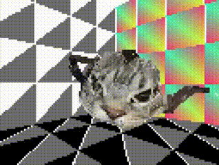

# A 3D game engine made for my A-Level Computer Science coursework.

by Osmund Beswick (i'm putting my name here so the exam moderators know this isn't just some rando's repo that i've written about ☠️)

### This is a simple game engine made with Python and Pygame. This is meant for demonstration rather than actual use (since I'm sure most people don't want their game to run sequentially on one cpu core), but if I make it faster in the future then maybe I'll use it for something.

## **Note:**

~~For some reason this runs *incredibly* slow on Windows. Literally it runs 20 times faster on my 11 year old MacBook Pro with Ubuntu than it does on my 2021 windows pc ☠️ Tbf it runs horribly on anything that doesn't border on precognition when it comes to single core cpu performance, but Windows seems to be a challenge for it regardless of the device you're running it on.~~ 

So it turns out this was because I was printing 13,429 debug messages to the console every frame and Linux is faster at printing stuff apparently 💀

## **Info:**

In my engine, you get fairly precice control over everything. Things in space are called Abstracts, which have a location and a set of axes which its children lie on (called a distortion). You can move, rotate and translate stuff, and their substracts will move accordingly.

You get fine control over the gameloop, as you create and manage it for each of your scenes. Check out sampleScene.py to see how it works! While it's less intuitive structuring an engine like this, I wanted to let users have much finer control over how their game runs 

You can import UV mapped Wavefront models with textures, as well as use all 2 (!!!) primitive shape generators I've built in.

For rendering, this uses custom (aka slow ☠️) implementations of common graphical and mathematical functions, from matrix multiplication to triangle filling, built using Pygame's graphics engine. This makes it easier to modify and expand upon depending on your needs if you want to do something specific (not a cope i swear)

On top of that, you have the option to use real-time surface normal lighting for your models if you'd like an even lower framerate! 😊

There's also stereo sound effects! 🤯🤯🤯 #revolutionary

It's pretty janky but I added a basic physics engine you can use for collisions; there's no angular velocity or anything but it should work well enough for most things. Big thanks to @something12356 for explainging the restitution maths to me!

But yeah, if you want to then have a play around with it! You can run and look through sampleScene to see how everything works, and use it as a basis for your own game. If you make anything using this, don't hesitate to show me! I'd love to see what you guys can do 👍
